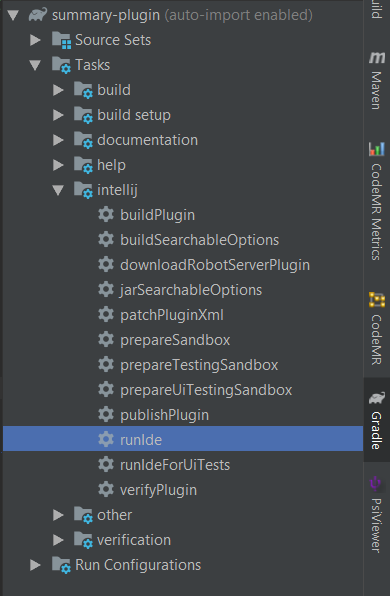
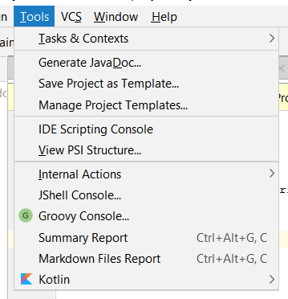
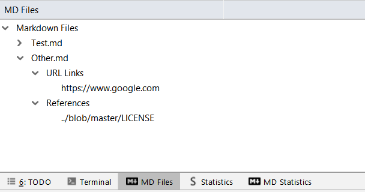
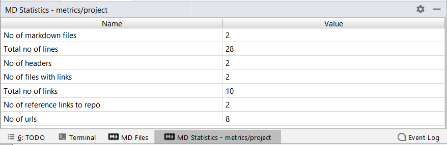
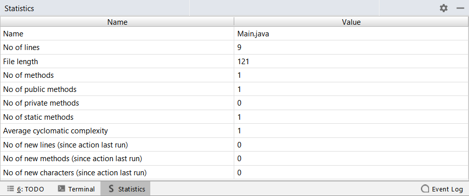

# Plugins for Intellij

## Running the plugin for the first time

Make sure the Gradle plugin is installed in your IDE.

Once the IDE is done downloading dependencies and refreshing the project, you can use the `Gradle` tool window
and follow the following steps:
* `Tasks > intellij > runIde` to run the plugin in a sandboxed instance  

## Markdown Files Plugin
In order to activate markdown files plugin go to tools menu
click on `Markdown Files Report`  
 
- In run tool window when you click on `MD Files`, it shows the all markdown files in the project. Under each markdown file you can find the **URL links** and **References** that it has  

- In run tool window when you click on `MD Statistics`, it shows the statistics for markdown files  

## Methods Plugin
In order to activate methods plugin go to tools menu
click on `Summary Report`  
 

- In run tool window when you click on `Statistics`, it shows the statistics for the current open java file  

