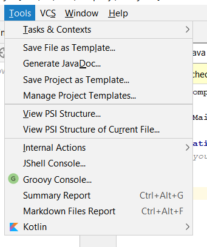
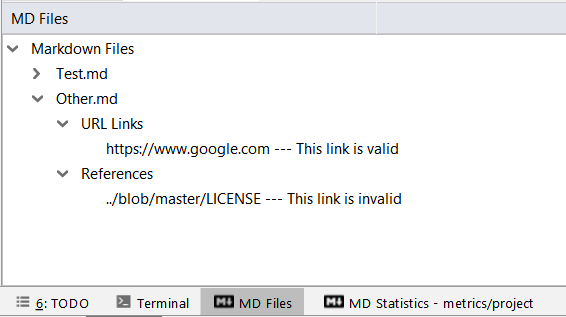

# Plugins for Intellij

## Running the plugin for the first time

Make sure the Gradle plugin is installed in your IDE, go to `File -> Open`, select the `build.gradle` file
and choose `Open as Project`. 

If you already imported the project when it was not based on Gradle, then choose the option to delete the existing 
project and reimport it.

Once the IDE is done downloading dependencies and refreshing the project, you can use the `Gradle` tool window
and use the following `Tasks`:
* `build > assemble` to build the project
* `intellij > runIde` to run the plugin in a sandboxed instance  

## Methods Plugin
Go to tools menu
Click on `Markdown Files Report`  
 
- In run tool window click on `MD Files`, this shows the all markdown files in the project. Under each markdown file you can find the **URL links** and **References** that it has  

- Click on `MD Statistics`, this shows the statistics for markdown files  

## Markdown Files Plugin
Go to tools menu
Click on `Summary Report`  
 

- In run tool window click on `Statistics`, this shows the statistics for the current open java file  

