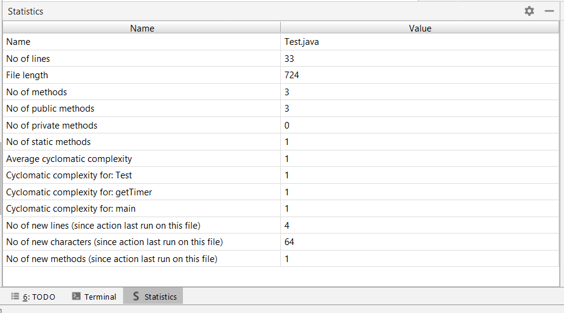

# Plugins for Intellij IDEA

A toy plugin for IntelliJ IDEA created by group of TU Delft students.

## Table of Contents
* [Running the plugin for the first time](#running-the-plugin-for-the-first-time)
* [Markdown Files Plugin](#markdown-files-plugin)
* [Methods Plugin](#methods-plugin)
* [Contributors](#contributors)

## Running the plugin for the first time
* Use following steps to run the plugin: 
Make sure the Gradle plugin is installed in your IDE.

  * Make sure the Gradle is installed in your computer
  * Then, install plugin repository to your computer
  * Open your 'Terminal' and go to the directory you installed the plugin
  * Then, run **"gradle runIde"**
  * Plugin is ready to use!

## Markdown Files Plugin 123
commit
1

In order to activate markdown files plugin go to tools menu click on `Markdown Files Report` 
or optionally use `Ctrl+Alt+F` shortcut

This will open 2 displays in the run tool window: `MD Files` and `MD Statistics - metrics/project`   
  

## Functionality
- In run tool window when you click on `MD Files`, it shows the all markdown files in the project. Under each markdown file you can find the **URL links** and **References** that it has. 
- Each link is accompanied by a valid / invalid tag. For internal repository links, this tag
automatically changes from **VALID** to **INVALID** when the file referenced is either **moved, renamed or deleted** - **INVALID** to **VALID** when the
file is **created, renamed or moved back** respectively.  
  
- In run tool window when you click on `MD Statistics - metrics/project`, it shows the statistics for markdown files. 
- When you change the content of a markdown file, delete a markdown file or add a new markdown file, all statistics are dynamically updated. So you always see up to date statistics.  
  

[inline link](build.gradle#L25)

[another link](https://github.com/tudorpopovici1/demo-plugin-jetbrains-project/blame/master/src/main/java/actions/MarkdownAction.java#L38)

[1]: https://www.jetbrains.com

## Methods Plugin
In order to activate methods plugin go to tools menu
click on `Summary Report` or optionally use `Ctrl+Alt+G` shortcut

This will open 1 display in the run tool window: `Statistics`   
  

## Functionality
- In run tool window when you click on `Statistics`, it shows the statistics for the current open java file. 
- If you click and open another Java file or change the content of the currently open file, it automatically refreshes the statistics shown in the table. It starts to display the renewed statistics of the current file.
- This action persists the data on disk in an XML format using the PersistentStateComponent interface. Therefore, between 2 consecutive runs of the plugin, it will display the number of new/deleted lines, characters and methods. This functionality also works when you close the IntelliJ IDEA editor between the plugin runs.   

## Contributors
* [Tudor Popovici](https://github.com/tudorpopovici1)
* [Tommaso Brandirali](https://github.com/TommasoBrandirali)
* [Ceren Ugurlu](https://github.com/cugurlu)
* [Irem Ugurlu](https://github.com/iremugurlu)
